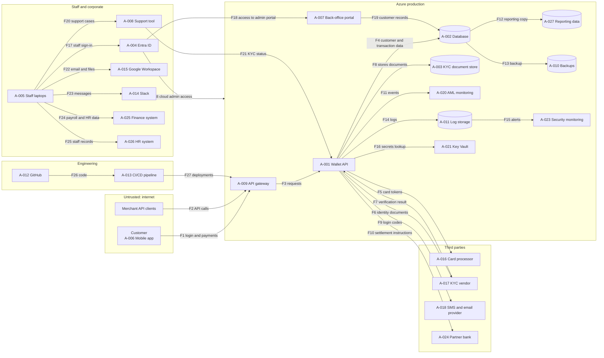

# HarbourPay Security Risk Assessment

A structured security risk assessment for a **fictional** Irish payments startup, built as a portfolio project while completing the Google Cybersecurity Certificate.

> Status: in progress. Results and metrics are added only after they have been measured.

## Problem

HarbourPay is a 50-person payments startup preparing for a partner-bank due diligence review within 90 days. Security priorities are currently set by gut feel. There is no risk register, no framework mapping and no incident playbook.

## Baseline (H0) and approach (H1)

- **H0:** unstructured prioritisation, a flat list of fixes ordered by whoever raises them loudest.
- **H1:** a scored risk register linked to a threat model and a NIST CSF 2.0 gap analysis, so priorities are explicit, repeatable and traceable to assets.

## How success is measured

- Every in-scope asset appears in at least one threat and one risk.
- Every risk has an owner, a treatment decision and a residual score.
- All NIST CSF 2.0 functions are assessed, with the evidence basis stated.
- **Consistency check:** 10 risks are re-scored blind one week later. Target: at least 80% within one point on likelihood and impact. The actual result is reported, pass or fail.

## Deliverables

| # | Deliverable | Location | Status |
|---|---|---|---|
| 1 | Company profile and assumptions | `docs/01-company-profile.md` | Draft |
| 2 | Methodology and scoring rubric | `docs/02-methodology.md` | Draft |
| 3 | Asset inventory | `data/assets.csv` | Not started |
| 4 | Data flow diagram | `docs/03-data-flow.md` | Not started |
| 5 | STRIDE threat model | `docs/04-threat-model.md` | Not started |
| 6 | Risk register | `data/risk_register.csv` | Not started |
| 7 | NIST CSF 2.0 gap analysis | `data/csf_gap_analysis.csv` | Not started |
| 8 | Incident response playbook | `docs/07-ir-playbook.md` | Not started |
| 9 | Executive summary | `docs/08-exec-summary.md` | Not started |
| 10 | Validation and limitations | `docs/09-validation.md` | Not started |

## Data quality checks

`scripts/validate_register.py` checks the CSV files for required columns, valid score ranges, correct score arithmetic, and that every risk points to a real asset. It runs in CI on every push.

```bash
python scripts/validate_register.py
python -m pytest
```
# 03 - Data Flow Diagram (in Docs)

Status: DRAFT. Check each flow against your own assumptions and edit.

Asset IDs refer to `data/assets.csv`. Each box is a trust zone. An arrow that crosses a box edge is a trust boundary crossing.



## Limitations

- The company is fictional, so likelihood scores are professional judgement, not measured data.
- This project demonstrates method. It cannot prove real-world risk reduction.
- Regulatory references must be checked against current official text before specific clauses are cited.

## Licence

MIT
