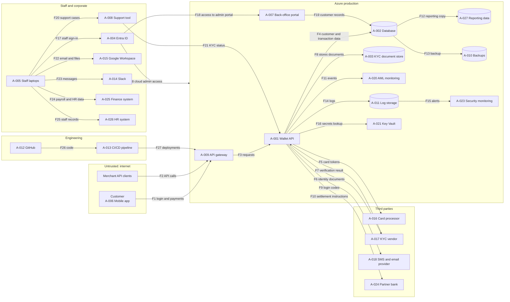

# 03 - Data Flow Diagram

Status: DRAFT. Check each flow against your own assumptions and edit.

Asset IDs refer to `data/assets.csv`. Each box is a trust zone. An arrow that crosses a box edge is a trust boundary crossing.

## Flow table

| Flow | From | To | Data | Classification | Crosses boundary | Protection assumed |
|---|---|---|---|---|---|---|
| F1 | Customer app (A-006) | API gateway (A-009) | Login details, SMS codes, payment requests | Confidential | Yes: Internet to Azure | TLS; password plus SMS code (assumption A-02 area) |
| F2 | Merchant API clients | API gateway (A-009) | Payment and account API calls | Confidential | Yes: Internet to Azure | TLS; merchant API keys; rate limiting not assumed |
| F3 | API gateway (A-009) | Wallet API (A-001) | Validated requests | Confidential | No | Internal TLS; gateway validation (assumed) |
| F4 | Wallet API (A-001) | Database (A-002) | Customer personal data, transactions | Restricted | No | Encryption at rest; service account access (assumed) |
| F5 | Wallet API (A-001) | Card processor (A-016) | Card tokens, payment instructions | Restricted | Yes: Azure to third party | TLS; API credentials from Key Vault (assumed) |
| F6 | Wallet API (A-001) | KYC vendor (A-017) | Passport and ID images, personal details | Restricted | Yes: Azure to third party | TLS; data processing agreement not yet verified |
| F7 | KYC vendor (A-017) | Wallet API (A-001) | Verification result, extracted identity data | Restricted | Yes: third party to Azure | TLS; response authenticity not checked (assumed, low confidence) |
| F8 | Wallet API (A-001) | KYC document store (A-003) | Stored ID images | Restricted | No | Encryption at rest; access limited to the service (assumed) |
| F9 | Wallet API (A-001) | SMS and email provider (A-018) | Phone numbers, emails, one-time codes | Confidential | Yes: Azure to third party | TLS; provider API key |
| F10 | Wallet API (A-001) | Partner bank (A-024) | Settlement instructions, transaction batches | Restricted | Yes: Azure to third party | Bank-specified authentication (to confirm); signed files not assumed |
| F11 | Wallet API (A-001) | AML monitoring (A-020) | Transaction events | Restricted | No | Internal access control (assumed) |
| F12 | Database (A-002) | Reporting data (A-027) | Copy of customer and transaction data | Restricted | No | Weaker access control than production (assumption A-05, low confidence) |
| F13 | Database (A-002) | Backup storage (A-010) | Full database backups | Restricted | No | Encrypted; restores untested (assumption A-04) |
| F14 | Wallet API (A-001) | Log storage (A-011) | Application logs, may contain personal data | Confidential | No | Access limited to engineers (assumed); log content not filtered |
| F15 | Log storage (A-011) | Security monitoring (A-023) | Logs and alert events | Confidential | No | Logs not yet centralised, so this flow is partial (assumption A-03) |
| F16 | Wallet API (A-001) | Key Vault (A-021) | Secrets and key requests | Restricted | No | Managed identity (assumed) |
| F17 | Staff laptops (A-005) | Entra ID (A-004) | Staff credentials, MFA responses | Restricted | No in diagram, but Entra ID is cloud so traffic crosses the internet | MFA for engineers and admins; not enforced for support staff (Decision 001) |
| F18 | Entra ID (A-004) | Back-office portal (A-007) | Sign-in tokens, role claims | Restricted | Yes: staff zone to Azure | Single sign-on; roles not reviewed (assumed) |
| F19 | Back-office portal (A-007) | Database (A-002) | Customer record views and edits | Restricted | No | Portal service account; no field-level restriction (assumed) |
| F20 | Staff laptops (A-005) | Customer support tool (A-008) | Support cases, KYC status, customer details | Restricted | No | No enforced MFA for support staff; personal devices allowed |
| F21 | Customer support tool (A-008) | Wallet API (A-001) | KYC status lookups | Restricted | Yes: staff zone to Azure | Shared service token (assumed, low confidence) |
| F22 | Staff laptops (A-005) | Google Workspace (A-015) | Email, shared documents | Confidential | No | Account MFA (assumed); no data loss prevention |
| F23 | Staff laptops (A-005) | Slack (A-014) | Messages, files | Confidential | No | Workspace sign-in; no data loss prevention |
| F24 | Staff laptops (A-005) | Finance system (A-025) | Payroll, invoices, payments data | Confidential | No | Role-based access (assumed) |
| F25 | Staff laptops (A-005) | HR system (A-026) | Staff personal data, contracts | Confidential | No | Role-based access (assumed) |
| F26 | GitHub (A-012) | CI/CD pipeline (A-013) | Source and infrastructure code | Confidential | No | Branch protection not enforced (assumed, low confidence) |
| F27 | CI/CD pipeline (A-013) | API gateway (A-009) | Production deployments | Confidential | Yes: engineering to Azure | Deployment credentials stored in the pipeline (assumed); high-impact path |
| F28 | Entra ID (A-004) | Azure resources (A-019) | Privileged cloud admin sessions | Restricted | Yes: staff zone to Azure | MFA for admins; no just-in-time elevation (assumed) |

## Where Restricted data crosses a boundary

| Flow | Why it matters |
|---|---|
| F5 | Card tokens and payment instructions leave our control to the card processor. |
| F6 | Passport and ID images go to an outside vendor. A breach there is a breach for us. |
| F7 | Data returns from the vendor. If a response can be forged, an attacker can approve fake identities. |
| F10 | Settlement instructions to the bank. Tampering means direct financial loss. |
| F18 | Staff reach the admin portal that can edit any customer record. |
| F21 | The support tool can read KYC status through a shared token. |
| F28 | Privileged access to the whole cloud environment. |

## Restricted flows that stay inside a zone but are weak

| Flow | Why it matters |
|---|---|
| F12 | Reporting copies are often less protected than production. |
| F13 | Backups hold everything, and restores are untested. |
| F20 | Support staff see Restricted data without enforced MFA, on possibly personal devices. |
